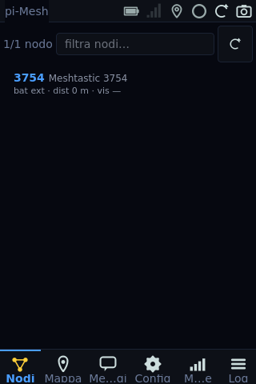
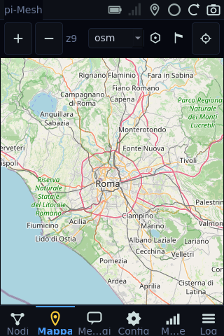
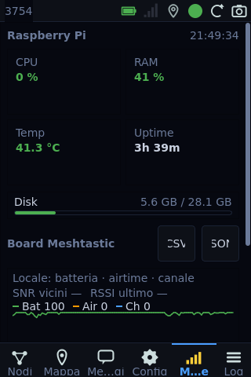
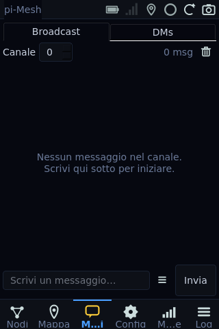
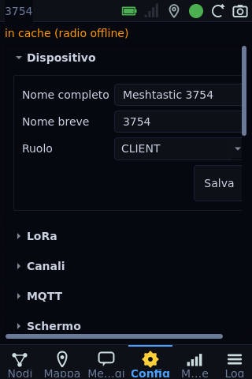
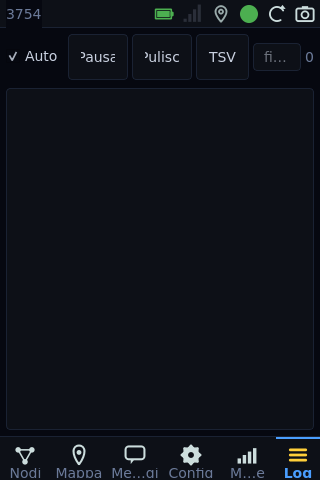

# pi-mesh-gui

A native Qt6 GUI for [Meshtastic](https://meshtastic.org/) LoRa mesh
networks, built to run directly on a Raspberry Pi framebuffer with a 3.5"
SPI touchscreen. No browser, no embedded web server — just a fast,
touch-friendly kiosk app that talks to the radio over USB.

<p align="center">
  
  
  
</p>

[](https://www.python.org/)
[](https://wiki.qt.io/Qt_for_Python)
[](https://www.raspberrypi.com/)
[](LICENSE)

---

## Highlights

- **Native Qt6 widgets** — runs on the Pi linuxfb stack without an X
  server, an SDL layer, or a browser engine. Cold-start to first paint
  in under 4 s on a Pi 3 A+.
- **Touch-first UI** — 44 px tap targets, on-screen keyboard, four built-in
  themes (dark / light / high-contrast / custom). Scrolls with the mouse
  wheel or the arrow / page keys (e.g. a rotary encoder mapped to them).
- **Single-process backend** — direct `meshtastic.SerialInterface` over
  USB, SQLite via `aiosqlite`, optional MQTT bridge, optional bots
  framework. No HTTP daemon to babysit.
- **Offline-friendly** — pre-downloaded tile pyramids, persistent
  message and telemetry history, works without internet.
- **Vector everywhere** — every status icon, tab icon, and metric icon
  is painted with `QPainter` so the UI doesn't depend on the font
  emoji coverage of whichever distro you're running.

---

## Screenshots

The kiosk runs at 320×480 (portrait) or 480×320 (landscape) on a Waveshare
3.5" SPI display. All screenshots are dark theme on a Pi 3 A+.

| Nodes | Map | Messages |
|:-:|:-:|:-:|
|  |  |  |
| Mesh-wide node list, signal / battery / age at a glance, tap to open the detail dialog. | Offline OSM / topo / satellite tiles with node markers, waypoints, neighbor SNR overlay and traceroute polylines. | Broadcast + DM threads, canned messages, unread badge on the tab bar. |

| Config | Metrics | Log |
|:-:|:-:|:-:|
|  |  |  |
| Collapsible sections for radio, channels, MQTT, modules, hardware (I²C, RTC, AP, GPIO, USB, …) and Pi admin. | Raspberry Pi sparklines + unified board chart (battery / airtime / channel) and per-node sensor tiles. | Live packet log with portnum filter chips and TSV export. |

---

## Features

### Input & navigation
- Tap to select; the bottom tab bar switches pages.
- **Scrolling**: the mouse wheel, or the **arrow keys** and **PageUp /
  PageDown / Home / End**, scroll the page currently on screen — convenient
  for a rotary encoder mapped to Up / Down. Text fields and value controls
  (combo box, spin box, slider) keep their native arrow behaviour, and item
  lists keep native arrow navigation.
- **On-screen keyboard**: appears when you tap a text field; dismiss it by
  tapping outside it or pressing the ✓ key. Set `PIMESH_GUI_NO_VKB=1` to
  disable it (useful on a desktop dev box).

### Nodes
- Real-time list of every mesh node — short name, hops, SNR, battery,
  distance, last-heard age.
- Detail dialog with admin actions: traceroute, request position,
  request telemetry, send DM, remote reboot, remote factory reset,
  forget node.

### Messaging
- Broadcast channel selector (0..7) + DM threads with read-state
  tracking.
- Configurable canned messages stored in SQLite for quick send.
- Unread DM badge on the bottom tab bar.

### Map
- Pan, pinch / wheel zoom (cursor-anchored), offline tile rendering.
- Three layer types: OSM, topo, satellite — all served from local
  `data/tiles/{layer}/{z}/{x}/{y}.png`.
- Node markers, neighbor links coloured by SNR, waypoint markers,
  traceroute polylines, user-placed POI markers.
- Long-press to open the "new location" dialog (add marker / send
  waypoint).

### Configuration
- Device identity, LoRa region + preset, channel PSKs, MQTT bridge,
  WiFi networks, display orientation + theme + custom accent.
- Nine Meshtastic module configs (ExtNotification, Store & Forward,
  Telemetry, Canned Messages, Range Test, Detection Sensor, Ambient
  Light, Neighbor Info, Serial).
- Hardware tools: I²C bus scan, RTC status, AP toggle, GPIO device
  editor, USB storage import.
- Pi admin: reboot, shutdown (double confirm), Pi factory reset.

### Telemetry & Metrics
- Raspberry Pi sparklines (CPU%, RAM%, temperature, uptime, disk).
- Aggregate board chart: battery, airtime TX, channel utilization on a
  shared 0..100 % axis, plus SNR-vicini / RSSI-ultimo chips.
- Per-node sensor tiles — battery, voltage, channel, airtime, uptime,
  temperature, humidity, pressure, gas resistance, IAQ, lux, UV,
  wind, rainfall, weight, distance, 3-channel power metrics,
  PM2.5 / PM10. Each tile is `icon + descriptive label + value` so a
  glance is enough to identify the sensor.
- CSV / JSON export of the telemetry history.

### Log
- Live `TELEMETRY_APP` / `NODEINFO_APP` / `TEXT_MESSAGE_APP` / etc.
  packet stream.
- Portnum filter chips that auto-populate as new types are seen.
- TSV export, pause / resume, auto-scroll toggle.

### Bots
- Extensible Meshtastic bot framework with five built-in bots: `ping`,
  `status`, `nodes`, `help`, `beacon`.
- Configurable prefix, per-bot enable / disable from the Config tab.

---

## Hardware

| Component | Details |
|---|---|
| Raspberry Pi 3 A+ or newer | Tested down to 512 MB RAM (Pi 3 A+); Bookworm armhf or arm64. |
| Meshtastic radio | USB-connected ESP32 boards: Heltec V3/V4, T-Beam, RAK WisBlock, LilyGo, etc. No `meshtasticd` daemon required. |
| 3.5" 320×480 SPI TFT | MPI3501 / Waveshare 3.5" / compatible. Portrait and landscape both supported and auto-detected from the running rotation. |
| Optional | RTC (DS3231 over I²C), USB storage for tile import, GPIO sensors, rotary encoder (map it to Up / Down keys for scrolling). |

---

## Installation

### 1 — Clone

```bash
cd ~
git clone https://github.com/yayoboy/pi-mesh-gui.git
cd pi-mesh-gui
```

### 2 — Install dependencies

On Raspberry Pi OS (Bookworm):

```bash
# Qt runtime. The shim in gui/_qt_shim.py makes either PySide6 or PyQt6
# work; on Bookworm armhf, apt PyQt6 (Qt 6.4) is the path of least
# resistance because there's no PySide6 wheel for that architecture.
sudo apt install -y python3-pyqt6 python3-pyqt6.qtsvg libqt6svg6 \
    qt6-qpa-plugins libegl1 libxcb-cursor0

# Core Python deps.
sudo pip3 install --break-system-packages -r requirements.txt
sudo pip3 install --break-system-packages qasync meshtastic aiosqlite

# Optional features — skip individually if you don't need them.
#   nmcli              → WiFi / AP configuration from the GUI
#   i2c-tools          → I²C scan section
#   paho-mqtt          → MQTT bridge
#   python3-gpiozero   → GPIO test buttons
sudo apt install -y network-manager i2c-tools python3-gpiozero
sudo pip3 install --break-system-packages paho-mqtt
```

> On x86_64 dev boxes / Pi 4 64-bit, prefer `PySide6-Essentials>=6.7`
> from pip. The shim is one-way (PySide6 → PyQt6 fallback) so as long
> as one of the two is importable, the GUI starts.

### 3 — Configure

```bash
cp config.env.example config.env
${EDITOR:-nano} config.env
```

Key settings:

```env
SERIAL_PATH=/dev/ttyACM0      # USB path of the Meshtastic board
DB_PATH=data/mesh.db          # SQLite store
LOG_LEVEL=INFO
MQTT_ENABLED=0                # 1 to enable bridge at startup
```

### 4 — First run (manual)

```bash
# Framebuffer on the SPI display (kiosk).
QT_QPA_PLATFORM=linuxfb:fb=/dev/fb1 python3 -m gui

# Standard X11 / Wayland dev session.
python3 -m gui
```

### 5 — Install as a system service

```bash
# X11 + matchbox WM + console blanking disabled + Xwrapper + the
# pimesh-gui systemd unit. Idempotent — safe to re-run.
sudo bash scripts/setup-display.sh

# NOPASSWD sudoers for the privileged paths the GUI calls: systemctl
# reboot/poweroff, /sys/class/backlight, /boot/firmware/config.txt,
# nmcli, mount. Without this the radio-side commands hang on the
# password prompt.
sudo bash scripts/setup-permissions.sh

sudo systemctl enable --now pimesh-gui
```

Check status:

```bash
systemctl status pimesh-gui
journalctl -u pimesh-gui -f
```

### 6 — Offline map tiles (optional)

```
data/tiles/osm/{z}/{x}/{y}.png
data/tiles/topo/{z}/{x}/{y}.png
data/tiles/satellite/{z}/{x}/{y}.png
```

`scripts/manage-tiles.sh` and `scripts/download_tiles.py` cover the
download + sync flow. USB-mounted tile sets are spliced under the same
root automatically (see `usb_storage.py`).

---

## Deployment & development

### Remote deploy to the Pi

```bash
sshpass -p pimesh rsync -avz \
  --exclude='.git' --exclude='__pycache__' --exclude='data/*.db' \
  ./ pimesh@pi-mesh2.local:~/pi-mesh-gui/

sshpass -p pimesh ssh pimesh@pi-mesh2.local \
  "sudo systemctl restart pimesh-gui"
```

### Run the test suite

```bash
pip install -r requirements-dev.txt
pytest -q                      # 368 tests, no hardware needed
```

### Regenerate the README screenshots

```bash
# On the Pi, against the live SQLite. Renders offscreen so it does not
# disturb pimesh-gui.service.
sudo QT_QPA_PLATFORM=offscreen PYTHONPATH=. python3 \
    scripts/capture_screenshots.py --theme dark --out docs/screenshots
```

---

## Architecture

```
pi-mesh-gui/
├── gui/                              # The Qt6 GUI itself
│   ├── __main__.py                   # python -m gui entry point
│   ├── _qt_shim.py                   # PySide6 ↔ PyQt6 compatibility
│   ├── app.py                        # QApplication + qasync bootstrap
│   ├── main_window.py                # Status bar + tab bar + window
│   ├── core/
│   │   ├── eventbus.py               # meshtasticd → Qt signal bridge
│   │   ├── settings.py               # In-memory cache + async write-through
│   │   ├── event_dispatcher.py       # Event-type → signal routing
│   │   └── tasks.py                  # Centralized qasync scheduler
│   ├── pages/                        # One module per bottom tab
│   │   ├── nodes_page.py
│   │   ├── map_page.py + map_view.py
│   │   ├── messages_page.py
│   │   ├── config_page.py + _config_*.py
│   │   ├── metrics_page.py + telemetry_page.py
│   │   └── log_page.py
│   ├── theme/
│   │   ├── palettes.py               # dark / light / hc / custom
│   │   ├── qss.py                    # QSS template, role properties
│   │   └── colors.py                 # Widget-level semantic tokens
│   └── widgets/                      # Vector icons, sparklines, vkb, toast …
│
├── bots/                             # Meshtastic bot framework
├── config.py                         # Env-driven runtime config
├── database.py                       # SQLite schema + queries (aiosqlite)
├── meshtasticd_client.py             # Serial interface + event queue
├── mqtt_bridge.py                    # Optional MQTT relay
├── rpi_telemetry.py                  # Pi sysfs metrics
├── usb_storage.py                    # Auto-mount + tile import
├── hardware_ops.py                   # I²C / RTC / GPIO helpers
├── wifi_ops.py                       # nmcli wrappers
├── system_ops.py                     # reboot / shutdown / factory-reset
├── display_ops.py                    # SPI display rotation, brightness
│
├── scripts/                          # Setup, tile download, screenshots
├── systemd/                          # pimesh-gui.service
└── tests/                            # pytest — hardware-free mocks
```

### Key design choices

- **Single asyncio loop** for both Qt and the radio I/O via
  [`qasync`](https://github.com/CabbageDevelopment/qasync). Slots stay
  sync; long work is dispatched with `gui.core.tasks.schedule(coro)`.
- **Event bus** (`EventBus(QObject)`) re-emits the meshtasticd fan-out
  queue as typed `pyqtSignal(dict)` — pages subscribe, no polling.
- **In-memory settings cache** with async DB write-through and a
  publish/subscribe API so theme / accent / orientation changes
  hot-reload without restart.
- **Vector icons everywhere** (`gui.widgets.status_icons`) — drawn with
  `QPainter` on a 14×14 design grid so the UI never depends on
  fontconfig finding an emoji font for a glyph.
- **Lazy page loading** — each bottom tab imports its page module on
  first tap, so cold start touches only `nodes_page`.

---

## License

MIT. See [`LICENSE`](LICENSE).

## Acknowledgments

- [Meshtastic](https://meshtastic.org/) for the protocol, firmware and
  Python client.
- [Qt for Python](https://wiki.qt.io/Qt_for_Python) (`PySide6` and
  `PyQt6`) for the UI framework.
- [qasync](https://github.com/CabbageDevelopment/qasync) for the
  Qt + asyncio loop bridge.
- OpenStreetMap, OpenTopoMap and ESRI for the map tile sources.
